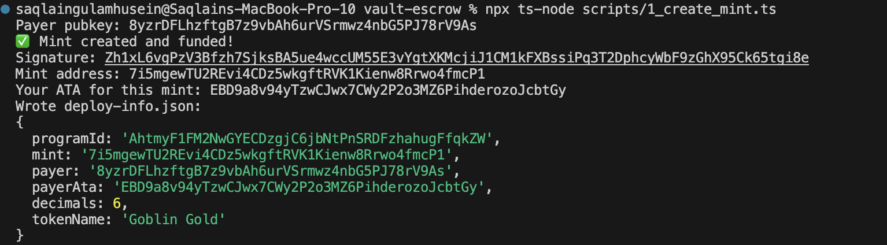
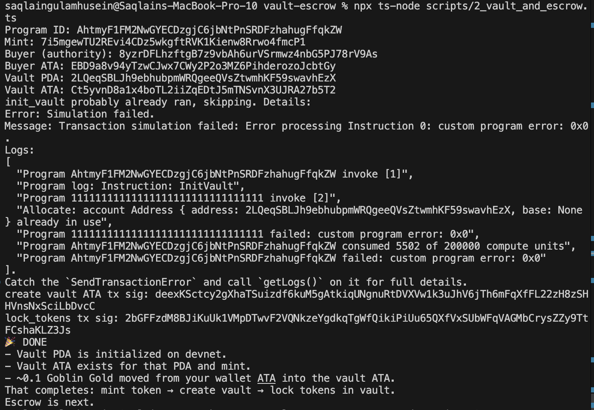
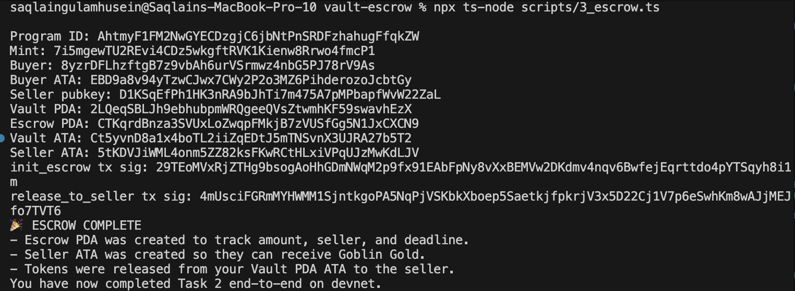

# Task 2: Token Mint → Vault Lock → Escrow Settlement (Solana Devnet)

This document proves that I:
1. Minted a custom SPL token on Solana devnet.
2. Created a vault PDA and locked those tokens inside it.
3. Created an escrow agreement and successfully released tokens from the vault to a seller under program logic.

All actions happened on Solana **devnet** using my own deployed Anchor program.

---

Task 2 requirements:

Mint a token with a creative name
✅ Goblin Gold
Mint: 7i5mgewTU2REvi4CDz5wkgftRVK1Kienw8Rrwo4fmcP1
Tx: Zh1xL6vgPzV3Bfzh7SjksBA5ue4wccUM55E3vYgtXKMcjiJ1CM1kFXBssiPq3T2DphcyWbF9zGhX95Ck65tgi8e

Create a Vault
✅ Vault PDA: 2LQeqSBLJh9ebhubpmWRQgeeQVsZtwmhKF59swavhEzX
Lock Tokens in the Vault on Devnet
✅ Vault ATA: Ct5yvnD8a1x4boTL2iiZqEDtJ5mTNSvnX3UJRA27b5T2
Lock tx: 2bGFFzdM8BJiKuUk1VMpDTwvF2VQNkzeYgdkqTgWfQikiPiUu65QXfVxSUbWFqVAGMbCrysZZy9TtFCshaKLZ3Js

Create an Escrow
✅ Escrow PDA: CTKqrdBnza3SVUxLoZwqpFMkjB7zVUSfGg5N1JxCXCN9
init_escrow tx: 29TEoMVxRjZTHg9bsogAoHhGDmNWqM2p9fx91EAbFpNy8vXxBEMVw2DKdmv4nqv6BwfejEqrttdo4pYTSqyh8i1m

## Screenshots

#### Mint
This shows the Goblin Gold mint address and the mint tx signature:
`Zh1xL6vgPzV3Bfzh7SjksBA5ue4wccUM55E3vYgtXKMcjiJ1CM1kFXBssiPq3T2DphcyWbF9zGhX95Ck65tgi8e`

#### Vault Lock
This shows the Vault PDA, Vault ATA, and the `lock_tokens` tx:
`2bGFFzdM8BJiKuUk1VMpDTwvF2VQNkzeYgdkqTgWfQikiPiUu65QXfVxSUbWFqVAGMbCrysZZy9TtFCshaKLZ3Js`

#### Escrow Release
This shows `init_escrow`, the Escrow PDA, and `release_to_seller`:
`4mUsciFGRmMYHWMM1SjntkgoPA5NqPjVSKbkXboep5SaetkjfpkrjV3x5D22Cj1V7p6eSwhKm8wAJjMEJfo7TVT6`

